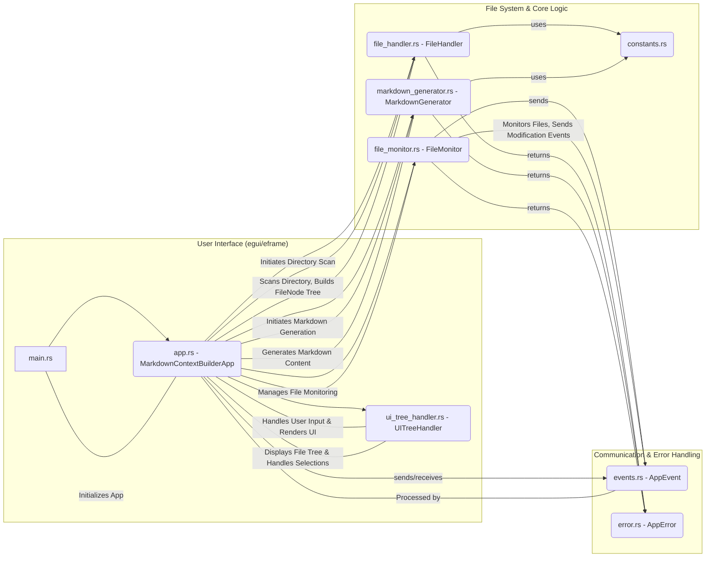
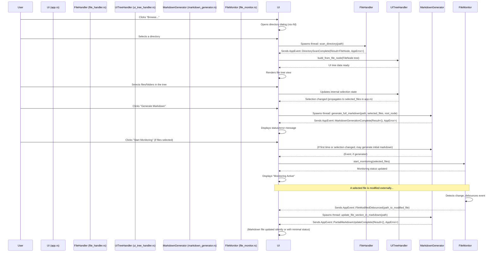

# Context manager

A desktop application built with Rust and `egui` to help users select a project directory, view its structure, choose specific files, and generate a comprehensive markdown file. This markdown includes the project's directory layout and the content of the selected files. The application also monitors selected files for changes and automatically updates the markdown.

## 1. Project Goal

The primary goal of this project is to provide a convenient tool for developers and technical writers to quickly generate context-rich markdown documentation for software projects. It aims to streamline the process of creating an overview of a project's structure and relevant code snippets, which is useful for onboarding, code reviews, or generating reports.

This Rust version is a rewrite of an original Python project, aiming for improved performance, a self-contained executable, and to explore Rust's capabilities for desktop application development.

## 2. Features

*   **Directory Selection**: Easily browse and select a project directory using native file dialogs.
*   **Hierarchical File Tree Display**: View the directory structure in an expandable tree view.
*   **File Selection**: Interactively select or deselect files and directories for inclusion in the markdown output.
*   **Configurable Ignore Patterns**: Utilizes `.gitignore` rules by default and allows for additional custom ignore patterns to filter out irrelevant files/directories (e.g., build artifacts, logs).
*   **Markdown Generation**: Produces a single markdown file containing:
    *   A visualization of the selected project structure.
    *   The full content of all selected files, each in its own code block.
*   **Automatic Markdown Updates**: Monitors selected files for changes and automatically regenerates the relevant sections in the markdown file, ensuring the context remains up-to-date.
*   **Status Feedback**: Provides UI feedback for ongoing operations (loading, generating) and success/error messages.
*   **Cross-Platform**: Built with `eframe`, enabling compilation for Windows, macOS, and Linux.

## 3. Project Structure

### 3.1. Directory Layout

```
context_builder_rst/
├── Cargo.toml              # Manages project dependencies and metadata
├── README.md               # This file
├── src/
│   ├── app.rs              # Main application logic, UI handling, state management
│   ├── constants.rs        # Application-wide constants (e.g., filenames, ignore patterns)
│   ├── error.rs            # Custom error types for the application
│   ├── events.rs           # Defines events for inter-thread communication
│   ├── file_handler.rs     # Handles directory scanning and building the file tree structure
│   ├── file_monitor.rs     # Monitors file system events for selected files
│   ├── main.rs             # Entry point of the application, initializes eframe
│   ├── markdown_generator.rs # Logic for generating the markdown output
│   └── ui_tree_handler.rs  # Manages the state and rendering of the UI file tree
└── target/                   # Build artifacts (generated by cargo)
```

### 3.2. Core Modules and Components

This diagram illustrates the main components and their interactions:



*   **`main.rs`**: The application's entry point. It initializes the logging framework (`env_logger`) and sets up `eframe` to run the `MarkdownContextBuilderApp`.
*   **`app.rs` (`MarkdownContextBuilderApp`)**: This is the core of the application, implementing the `eframe::App` trait. It manages the overall application state (current directory, root `FileNode`, UI messages, loading states), handles all user interactions from the `egui` interface, orchestrates background tasks like directory scanning and markdown generation by spawning threads, and processes `AppEvent`s received from these background tasks.
*   **`ui_tree_handler.rs` (`UITreeHandler`)**: Manages the state and rendering of the hierarchical file tree in the UI. It translates the `FileNode` structure (from `file_handler.rs`) into a set of `UITreeNode`s that `egui` can render. It handles user selections in the tree, including propagation of selection state to parent/child nodes.
*   **`file_handler.rs` (`FileHandler`)**: Responsible for scanning a given directory. It uses the `ignore` crate to traverse the file system, respecting `.gitignore` files and other ignore patterns defined in `constants.rs`. It builds a `FileNode` tree, which is a recursive structure representing files and directories.
*   **`markdown_generator.rs` (`MarkdownGenerator`)**: Contains the logic to generate the final markdown string. It takes the root `FileNode` and the list of selected file paths to construct the project structure section and append the content of each selected file. It utilizes `tempfile` for atomic writes to the output file, preventing data corruption.
*   **`file_monitor.rs` (`FileMonitor`)**: Implements file system watching using the `notify` crate. When monitoring is active, it watches the selected files for modifications. It includes a debouncing mechanism to prevent overly frequent updates from rapid file changes, sending an `AppEvent::FileModifiedDebounced` to `app.rs`.
*   **`events.rs` (`AppEvent`)**: Defines an enum for messages passed between the main UI thread (`app.rs`) and the background worker threads. This allows for non-blocking operations and keeps the UI responsive. Examples include `DirectoryScanComplete` and `MarkdownGenerationComplete`.
*   **`error.rs` (`AppError`)**: Defines the application's custom error types using the `thiserror` crate. This provides a structured way to handle and report errors from different modules.
*   **`constants.rs`**: A central place for application-wide constants, such_as the default output filename (`project_structure.md`), markdown formatting strings, ignore patterns, and UI-related durations.

## 4. Workflow / Event Flow

A typical user workflow and the corresponding event flow within the application:



## 5. Implementation Details (Rust Focus)

This section highlights some of the Rust patterns, language features, and solutions employed in this project, which might be particularly interesting for those new to Rust.

### 5.1. Key Crates Used

*   **`eframe` / `egui`**: The core of the GUI. `eframe` provides the platform abstraction and application lifecycle, while `egui` is the immediate mode GUI library used to define the UI elements and layout.
*   **`ignore`**: Used for efficient directory traversal. It intelligently respects `.gitignore` files, custom ignore files, and global ignore configurations, making it easy to filter out unwanted files.
*   **`notify`**: Provides cross-platform file system event monitoring. It's used to detect changes in selected files for automatic markdown updates.
*   **`thiserror`**: A derive macro helper for creating custom error types. It simplifies the process of implementing `std::error::Error` and formatting error messages.
*   **`anyhow`**: While `thiserror` is used for specific, typed errors, `anyhow` (a listed dependency) is available for more flexible error handling, especially for functions that need to return a generic "any error" type or for easy conversion between error types.
*   **`log` / `env_logger`**: Standard logging facade (`log`) and an implementation (`env_logger`) that allows configuring log levels via environment variables (e.g., `RUST_LOG=debug`).
*   **`rfd` (Rusty File Dialogs)**: Provides simple, cross-platform native file dialogs for opening directories.
*   **`tempfile`**: Used to create temporary files for atomic write operations. This ensures that the output markdown file is not left in a corrupted state if the application crashes or is interrupted during a write.
*   **`uuid`**: Used for generating unique IDs, which can be helpful for `egui` widget identification if path-based IDs prove insufficient in complex scenarios (though currently, paths are the primary ID source for tree nodes).

### 5.2. Core Rust Concepts in Action

*   **Ownership and Borrowing**: These are Rust's cornerstone features for memory safety without a garbage collector. The compiler's borrow checker ensures that references to data are always valid and that data isn't mutated while immutable references exist.
    *   *Challenge Example*: Sharing application state (`self` in `MarkdownContextBuilderApp`) between UI rendering logic and event handlers, or passing data to new threads.
    *   *Solution Example*: Cloning data (like `PathBuf`, `String`, or even `FileNode` when moved to a thread or to avoid borrow conflicts within a single function scope if `self` is already borrowed). Using `Arc<Mutex<T>>` would be another common pattern for shared mutable state, though this project primarily uses message passing (`mpsc`) for thread communication.
*   **`Result<T, E>` and `Option<T>`**: These enums are Rust's primary tools for handling operations that might fail or values that might be absent.
    *   `Result`: All functions that can encounter a recoverable error (e.g., file I/O in `file_handler.rs` or `markdown_generator.rs`) return a `Result<SuccessType, ErrorType>`. The `?` operator is used extensively to propagate errors cleanly. Our `AppError` enum serves as `ErrorType`.
    *   `Option`: Used for values that may or may not be present, like `current_directory: Option<PathBuf>` in `app.rs`, or when a search might not find anything.
*   **Traits**: Traits define shared behavior. `eframe::App` is the most prominent trait, implemented by `MarkdownContextBuilderApp` to define the application's lifecycle and UI rendering. We also implemented standard traits like `Ord`, `PartialOrd` for `FileNode` to define custom sorting logic.
*   **Structs and Enums**: These are user-defined types. Structs like `FileNode`, `UITreeNode`, `MarkdownContextBuilderApp` group related data. Enums like `AppEvent`, `AppError`, and `SelectionState` define types that can be one of several variants.
*   **Pattern Matching (`match`)**: A powerful control flow construct used to destructure enums (`Result`, `Option`, `AppEvent`) and execute code based on their variants. This ensures all cases are handled, contributing to Rust's robustness.
*   **Closures**: Anonymous functions used extensively in `egui` for UI construction (e.g., `ui.horizontal(|ui| { ... })`) and for passing behavior to functions or threads.
*   **Concurrency with Threads and Channels (`std::thread`, `std::sync::mpsc`)**:
    *   *Challenge*: Performing I/O-bound tasks (directory scanning, file reading/writing for markdown) without freezing the UI.
    *   *Solution*: These tasks are spawned onto separate system threads. `std::sync::mpsc` (multiple producer, single consumer) channels are used for communication: background threads send `AppEvent` messages back to the main UI thread in `app.rs`, which then updates the application state and UI.
*   **Error Handling with `thiserror`**:
    *   *Challenge*: Defining clear, structured, and ergonomic error types.
    *   *Solution*: `src/error.rs` uses `thiserror` to define the `AppError` enum. Attributes like `#[error("...")]` allow specifying display messages for each error variant, and `#[from]` can automatically convert errors from other libraries (like `notify::Error`).
*   **Lifetimes**: While often inferred by the Rust compiler (especially in smaller functions or when data is owned), lifetimes are parameters that define the scope for which a reference is valid. They are crucial when structs hold references or when functions return references.
    *   *Challenge Example*: A subtle lifetime issue was encountered in `markdown_generator.rs` where bytes from a `String` conversion needed to outlive the temporary expression they were derived from.
    *   *Solution Example*: Binding the result of `e.into_bytes()` to a variable within the same scope ensured its lifetime was extended sufficiently for subsequent operations.

### 5.3. Key Challenges and Solutions During Development

*   **Efficient and Accurate Directory Traversal**: Ensured by using the `ignore` crate, which handles various ignore files (`.gitignore`, global gitignore, etc.) and provides options for symlink handling and hidden file visibility. The `WalkBuilder` allows fine-tuning this behavior. Custom ignore patterns from `constants.rs` are added as overrides.
*   **Responsive UI with Background Tasks**: Achieved by offloading directory scanning, markdown generation, and file monitoring to separate threads. The main UI thread remains unblocked and communicates with these threads via `mpsc` channels, processing `AppEvent`s to update its state and the display (e.g., showing spinners or status messages).
*   **Reliable File System Monitoring with Debouncing**: The `notify` crate provides the raw file system events. A custom debouncing mechanism was implemented in `FileMonitor` using a separate thread and a `HashMap` to track event timestamps. This prevents the application from overreacting to a burst of file modifications (e.g., during a save operation that triggers multiple events).
*   **State Management in an Immediate Mode GUI (`egui`)**: `egui` rebuilds the UI from scratch every frame. All persistent state (e.g., selected directory, file tree structure, checkbox states, status messages) must be explicitly stored in the `MarkdownContextBuilderApp` struct and the `UITreeHandler`.
*   **Hierarchical Tree UI with Complex Selection Logic**: The `UITreeHandler` manages a `Vec<UITreeNode>` representing the visual tree. Logic was implemented to:
    *   Build this tree from the `FileNode` structure.
    *   Render it using `egui::CollapsingHeader` for directories and `egui::Checkbox` for items.
    *   Handle selection changes, propagating selections to children (when a directory is selected/deselected) and updating the selection state of parent directories (to reflect unselected, partially selected, or fully selected children).
*   **Atomic Markdown Output**: To prevent data loss or file corruption if the application is terminated mid-write, the `markdown_generator.rs` uses the `tempfile` crate. The complete markdown is first written to a temporary file in the same directory as the target. Only upon successful completion is this temporary file atomically persisted (renamed) to the final `project_structure.md` path.
*   **Borrow Checker Conflicts**: Several instances required careful management of borrows, especially within `app.rs` where methods on `self` were called that might require `&mut self` while other parts of `self` were already immutably borrowed (e.g., for UI rendering or in closures). Solutions involved cloning data before passing it to closures or reordering operations.

## 6. How to Build and Run

1.  **Install Rust**: If you haven't already, install Rust and Cargo from [rust-lang.org](https://www.rust-lang.org/).
2.  **Clone the Repository** (if applicable, otherwise skip if you have the project locally):
    ```bash
    # git clone <repository-url>
    # cd context_builder_rst
    ```
3.  **Build the Project**:
    *   For a development (debug) build:
        ```bash
        cargo build
        ```
    *   For a production (release, optimized) build:
        ```bash
        cargo build --release
        ```
4.  **Run the Application**:
    *   Using Cargo (debug build by default):
        ```bash
        cargo run
        ```
    *   Using Cargo (release build):
        ```bash
        cargo run --release
        ```
    *   Alternatively, run the executable directly after building (e.g., for release):
        ```bash
        ./target/release/context_builder_rst
        ```
        (On Windows, this would be `.\target\release\context_builder_rst.exe`)

5.  **Check for Errors (Development)**:
    To quickly check your code for errors without performing a full compilation:
    ```bash
    cargo check
    ```

## 7. Dependencies

The key dependencies for this project are managed in `Cargo.toml` and include:

*   `eframe = "0.27"` & `egui = "0.27"`: For the GUI framework.
*   `notify = "6.1"`: For file system monitoring.
*   `ignore = "0.4"`: For directory traversal and gitignore handling.
*   `tempfile = "3.8"`: For atomic file writes.
*   `thiserror = "1.0"`: For custom error types.
*   `anyhow = "1.0"`: For flexible error handling.
*   `log = "0.4"` & `env_logger = "0.10"`: For logging.
*   `rfd = "0.14"`: For native file dialogs.
*   `uuid = { version = "1.6", features = ["v4"] }`: For unique ID generation.

---
This `README.md` provides a comprehensive overview of the Context Builder (Rust Edition) project, its architecture, and key implementation aspects. 