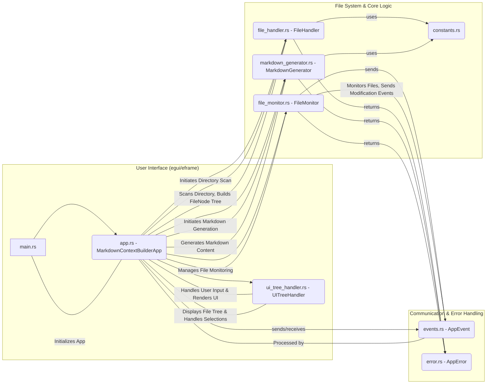
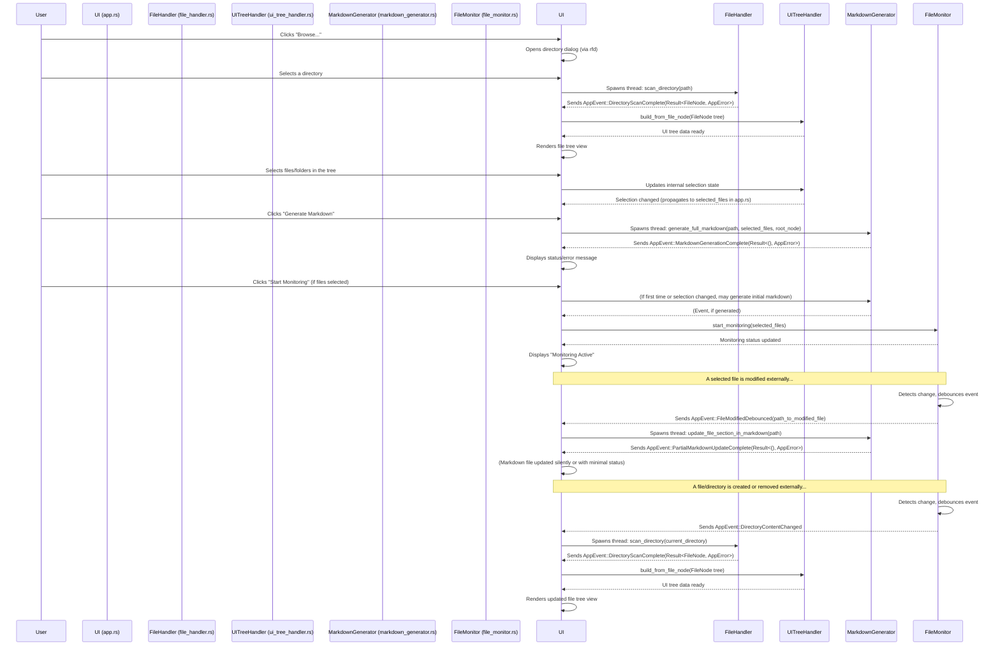

# Context manager

A desktop application built with Rust and `egui` to help users select a project directory, view its structure, choose specific files, and generate a comprehensive markdown file. This markdown includes the project's directory layout and the content of the selected files. The application also monitors selected files for changes and automatically updates the markdown.

## 1. Project Goal

The primary goal of this project is to provide a convenient tool for developers and technical writers to quickly generate context-rich markdown documentation for software projects. It aims to streamline the process of creating an overview of a project's structure and relevant code snippets, which is useful for onboarding, code reviews, or generating reports.

This Rust version is a rewrite of an original Python project, aiming for improved performance, a self-contained executable, and to explore Rust's capabilities for desktop application development.

## 2. Features

*   **Directory Selection**: Easily browse and select a project directory using native file dialogs.
*   **Hierarchical File Tree Display**: View the directory structure in an expandable tree view.
*   **File Selection**: Interactively select or deselect files and directories for inclusion in the markdown output.
*   **Configurable Ignore Patterns**: Utilizes `.gitignore` rules by default and allows for additional custom ignore patterns to filter out irrelevant files/directories (e.g., build artifacts, logs).
*   **Markdown Generation**: Produces a single markdown file containing:
    *   A visualization of the selected project structure.
    *   The full content of all selected files, each in its own code block.
*   **Automatic Markdown Updates**: Monitors the selected project directory for changes (creation, modification, deletion) and automatically regenerates the relevant sections in the markdown file, ensuring the context remains up-to-date. If the directory structure changes (files/folders added or removed), the application will re-scan the directory and update the displayed file tree.
*   **Status Feedback**: Provides UI feedback for ongoing operations (loading, generating) and success/error messages.
*   **Cross-Platform**: Built with `eframe`, enabling compilation for Windows, macOS, and Linux.

## 3. Project Structure

### 3.1. Directory Layout

```
context_builder/
├── Cargo.toml              # Manages project dependencies and metadata
├── README.md               # This file
├── src/
│   ├── app.rs              # Main application logic, UI handling, state management
│   ├── constants.rs        # Application-wide constants (e.g., filenames, ignore patterns)
│   ├── error.rs            # Custom error types for the application
│   ├── events.rs           # Defines events for inter-thread communication
│   ├── file_handler.rs     # Handles directory scanning and building the file tree structure
│   ├── file_monitor.rs     # Monitors the selected project directory recursively for file system events (create, modify, delete)
│   ├── main.rs             # Entry point of the application, initializes eframe
│   ├── markdown_generator.rs # Logic for generating the markdown output
│   └── ui_tree_handler.rs  # Manages the state and rendering of the UI file tree
└── target/                   # Build artifacts (generated by cargo)
```

### 3.2. Core Modules and Components

This diagram illustrates the main components and their interactions:



*   **`main.rs`**: The application's entry point. It initializes the logging framework (`env_logger`) and sets up `eframe` to run the `MarkdownContextBuilderApp`.
*   **`app.rs` (`MarkdownContextBuilderApp`)**: This is the core of the application, implementing the `eframe::App` trait. It manages the overall application state (current directory, root `FileNode`, UI messages, loading states), handles all user interactions from the `egui` interface, orchestrates background tasks like directory scanning and markdown generation by spawning threads, and processes `AppEvent`s received from these background tasks.
*   **`ui_tree_handler.rs` (`UITreeHandler`)**: Manages the state and rendering of the hierarchical file tree in the UI. It translates the `FileNode` structure (from `file_handler.rs`) into a set of `UITreeNode`s that `egui` can render. It handles user selections in the tree, including propagation of selection state to parent/child nodes.
*   **`file_handler.rs` (`FileHandler`)**: Responsible for scanning a given directory. It uses the `ignore` crate to traverse the file system, respecting `.gitignore` files and other ignore patterns defined in `constants.rs`. It builds a `FileNode` tree, which is a recursive structure representing files and directories.
*   **`markdown_generator.rs` (`MarkdownGenerator`)**: Contains the logic to generate the final markdown string. It takes the root `FileNode` and the list of selected file paths to construct the project structure section and append the content of each selected file. It utilizes `tempfile` for atomic writes to the output file, preventing data corruption.
*   **`file_monitor.rs` (`FileMonitor`)**: Implements file system watching using the `notify` crate. When monitoring is active, it watches the entire selected project directory recursively for creation, modification, and deletion events. It includes a debouncing mechanism to prevent overly frequent updates from rapid file changes, sending appropriate `AppEvent`s (`FileModifiedDebounced` or `DirectoryContentChanged`) to `app.rs`.
*   **`events.rs` (`AppEvent`)**: Defines an enum for messages passed between the main UI thread (`app.rs`) and the background worker threads. This allows for non-blocking operations and keeps the UI responsive. Examples include `DirectoryScanComplete`, `MarkdownGenerationComplete`, `FileModifiedDebounced`, and `DirectoryContentChanged`.
*   **`error.rs` (`AppError`)**: Defines the application's custom error types using the `thiserror` crate. This provides a structured way to handle and report errors from different modules.
*   **`constants.rs`**: A central place for application-wide constants, such_as the default output filename (`project_structure.md`), markdown formatting strings, ignore patterns, and UI-related durations.

## 4. Workflow / Event Flow

A typical user workflow and the corresponding event flow within the application:



## 5. Implementation Details (Rust Focus)

This section highlights some of the Rust patterns, language features, and solutions employed in this project, which might be particularly interesting for those new to Rust.

### 5.1. Key Crates Used

*   **`eframe` / `egui`**: The core of the GUI. `eframe` provides the platform abstraction and application lifecycle, while `egui` is the immediate mode GUI library used to define the UI elements and layout.
*   **`ignore`**: Used for efficient directory traversal. It intelligently respects `.gitignore` files, custom ignore files, and global ignore configurations, making it easy to filter out unwanted files.
*   **`notify`**: Provides cross-platform file system event monitoring. It's used to detect changes in selected files for automatic markdown updates.
*   **`thiserror`**: A derive macro helper for creating custom error types. It simplifies the process of implementing `std::error::Error` and formatting error messages.
*   **`anyhow`**: While `thiserror` is used for specific, typed errors, `anyhow` (a listed dependency) is available for more flexible error handling, especially for functions that need to return a generic "any error" type or for easy conversion between error types.
*   **`log` / `env_logger`**: Standard logging facade (`log`) and an implementation (`env_logger`) that allows configuring log levels via environment variables (e.g., `RUST_LOG=debug`).
*   **`rfd` (Rusty File Dialogs)**: Provides simple, cross-platform native file dialogs for opening directories.
*   **`tempfile`**: Used to create temporary files for atomic write operations. This ensures that the output markdown file is not left in a corrupted state if the application crashes or is interrupted during a write.
*   **`uuid`**: Used for generating unique IDs, which can be helpful for `egui` widget identification if path-based IDs prove insufficient in complex scenarios (though currently, paths are the primary ID source for tree nodes).

### 5.2. Core Rust Concepts in Action

*   **Ownership and Borrowing**: These are Rust's cornerstone features for memory safety without a garbage collector. The compiler's borrow checker ensures that references to data are always valid and that data isn't mutated while immutable references exist.
    *   *Challenge Example*: Sharing application state (`self` in `MarkdownContextBuilderApp`) between UI rendering logic and event handlers, or passing data to new threads.
    *   *Solution Example*: Cloning data (like `PathBuf`, `String`, or even `FileNode` when moved to a thread or to avoid borrow conflicts within a single function scope if `self` is already borrowed). Using `Arc<Mutex<T>>` would be another common pattern for shared mutable state, though this project primarily uses message passing (`mpsc`) for thread communication.
*   **`Result<T, E>` and `Option<T>`**: These enums are Rust's primary tools for handling operations that might fail or values that might be absent.
    *   `Result`: All functions that can encounter a recoverable error (e.g., file I/O in `file_handler.rs` or `markdown_generator.rs`) return a `Result<SuccessType, ErrorType>`. The `?` operator is used extensively to propagate errors cleanly. Our `AppError` enum serves as `ErrorType`.
    *   `Option`: Used for values that may or may not be present, like `current_directory: Option<PathBuf>` in `app.rs`, or when a search might not find anything.
*   **Traits**: Traits define shared behavior. `eframe::App` is the most prominent trait, implemented by `MarkdownContextBuilderApp` to define the application's lifecycle and UI rendering. We also implemented standard traits like `Ord`, `PartialOrd` for `FileNode` to define custom sorting logic.
*   **Structs and Enums**: These are user-defined types. Structs like `FileNode`, `UITreeNode`, `MarkdownContextBuilderApp` group related data. Enums like `AppEvent`, `AppError`, and `SelectionState` define types that can be one of several variants.
*   **Pattern Matching (`match`)**: A powerful control flow construct used to destructure enums (`Result`, `Option`, `AppEvent`) and execute code based on their variants. This ensures all cases are handled, contributing to Rust's robustness.
*   **Closures**: Anonymous functions used extensively in `egui` for UI construction (e.g., `